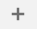
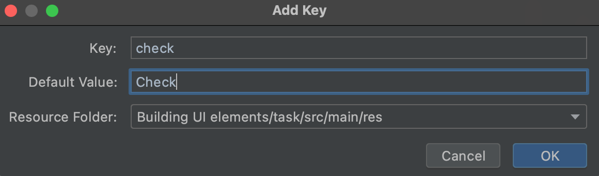

Follow [the steps below](https://developer.android.com/training/basics/firstapp/building-ui#button):

 - In the **Palette panel**, click **Buttons**.
 - Drag the **Button** widget into the design editor and drop it near the right side.
 - Create a constraint from the left side of the button to the right side of the text box.
 - To constrain the views in a horizontal alignment, create a constraint between the 
   text baselines. To do so, right-click the button and then select **Show Baseline** 
   action in **Layout Editor**. The baseline anchor appears inside the button. 
   Click and hold this anchor, and then drag it to the baseline anchor that appears in the 
   adjacent text box. 

The button should have id "button" and display the text "Check". You also might have noticed a warning
about hardcoded text used for the button. To change the text displayed on the button, do the following:
- In the Course window, open src > main > res > values > strings.xml
  This is a [string resources](https://developer.android.com/guide/topics/resources/string-resource) 
  file, where you can specify and manage all of your UI strings.
- Click **Open editor** at the top of the window.
- Click  (Add Key) to create a new string as the display text for the button. 
  At this point, the window shown below opens. In the **Add Key** dialog box, complete the following steps:

  - Enter "check" in the Key field.
  - Enter "Enter a message" in the Default Value field.
  - Click OK.

    

To return to the layout file, click activity_main.xml in the tab bar. Then, add the strings as follows:

- Click the button in the layout. If the Attributes window isn't already visible on the right, click Attributes on the right sidebar.
- Locate the text property, which is currently set to "Button" and delete the value.
- Click  (Pick a Resource), which is to the right of the text box. In the dialog that appears, double-click `check` from the list.

 