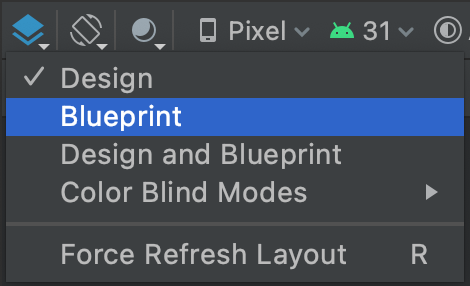
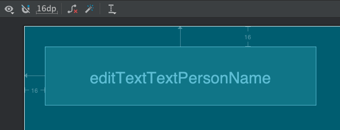

In this lesson, you learn how to create a layout 
that includes a text box and a button. This sets up the next lesson, where you learn 
how to make the app respond when the button is tapped.

Android provides an XML vocabulary for ViewGroup and View classes, so most of your UI is defined in XML files.
However, rather than teach you to write XML, this lesson shows you how to create a layout using Android 
Studio's Layout Editor. The Layout Editor writes the XML for you as you drag and drop views to build your layout.

Add a text box
-------------

A text box can be used to enter some text into the app, such as a username or a response to a question.

In the **Select Design Surface** drop-down menu, select **Blueprint**.

    

Follow [these steps](https://developer.android.com/training/basics/firstapp/building-ui#textbox) to add a text box:

 - First, you need to remove what's already in the layout. Click **TextView** in the 
   **Component Tree** panel and then press the **Delete** key.
 - In the **Palette** panel, click **Text** to show the available text controls.
 - Drag the **Plain Text** into the design editor and drop it near the top of 
   the layout. This is an **EditText** widget that accepts plain text input.
 - Click the view in the design editor. You can now see the square handles to 
   resize the view on each corner, and the circular constraint anchors on each side. 
   For better control, you might want to zoom in on the editor. To do so, use the **Zoom** 
   buttons in the **Layout Editor** toolbar.
 - Click and hold the anchor on the top side, drag it up until it snaps to the top 
   of the layout, and then release it. That's a constraint: it constrains the view 
   within the default margin that was set. In this case, you set it to 16 dp from the 
   top of the layout.
 - Use the same process to create a constraint from the left side of the view to the 
   left side of the layout.

The result should look as shown in the figure below.

    

