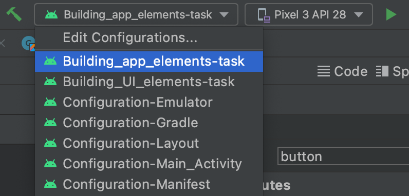

Emulator
-------

The Android Emulator simulates Android devices on your computer so that you can test 
your application on a variety of devices and Android API levels without needing to have 
each physical device.

The emulator provides almost all of the capabilities of a real Android device. 
You can simulate incoming phone calls and text messages, specify the location 
of the device, simulate different network speeds, simulate rotation and other hardware 
sensors, access the Google Play Store, and much more. Testing your app on the emulator is 
faster and easier than doing so on a physical device. 

To run the app on the emulator, we will follow [this brief guide](https://developer.android.com/studio/run/managing-avds#createavd).

 - Open the AVD manager (`Tools > AVD Manager`).
 - Click `Create Virtual Device` at the bottom of the AVD Manager dialog.
 - Select a hardware profile and then click `Next`.
 - Select the system image for a particular API level and then click `Next`.
 - Change AVD properties as needed and then click `Finish`.

 Now your virtual device is set up and you can run any task of your application
 by selecting the task in the **Edit Run/Debug Configurations**
 drop-down menu as shown in the figure below.

    

 
Then simply press the `Run` button next to the target device drop-down menu. Android Studio will install the app on the AVD
 and start the emulator.